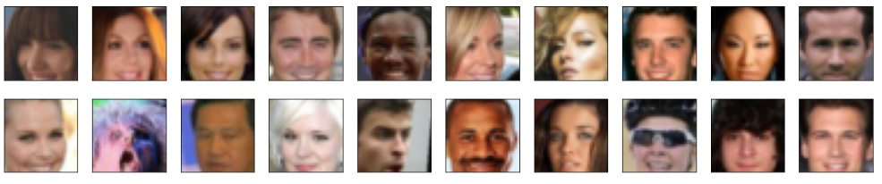
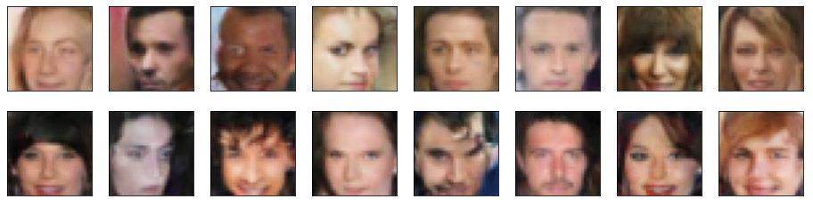

# Deep-Fake-Generator
Generating Fake Images using DC-GAN model

## Face-Generator

In this project, I defined and trained a DCGAN model on a dataset of faces. The goal was to get a generator network to generate new images of faces that look as realistic as possible!

## Dataset Images

## Generated Images

